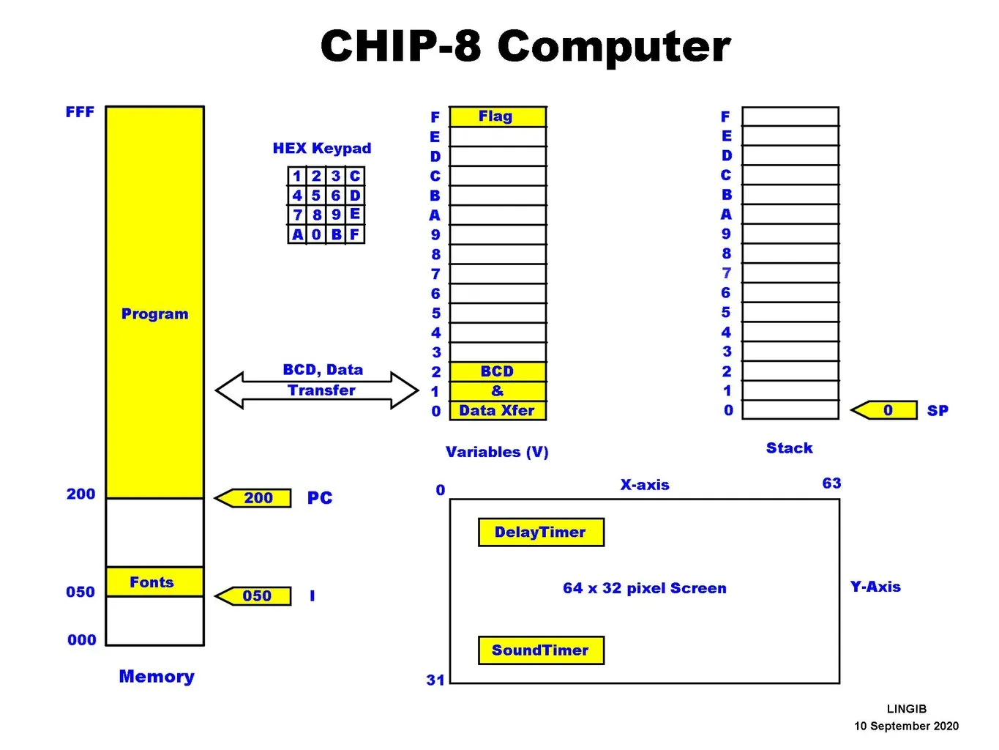

## Introduction

L’objectif de ce projet est de recréer un émulateur chip 8 from scratch

(Regarder les documents en anglais ⇒ plus complet)

À l’origine, CHIP 8 est une machine virtuelle 8 bits

La définition du terme émulé est 
« chercher à imiter ». Il faut voir dans l'émulation une imitation du 
comportement physique d'un matériel par un logiciel, et ne pas la 
confondre avec la simulation.

Théoriquement, il est donc possible de créer un émulateur pour 
toutes les machines électroniques. Pour ce faire, il suffit juste de :

- connaître ses caractéristiques ;
- trouver un support au moins aussi puissant que la machine à émuler ;
- traduire les caractéristiques.

Les consoles sont constituées de 4 composants principaux, généralement :

- Micro processeur
- mémoire vive
- carte graphique
- Périphérique de contrôle

## Caractéristique Technique

Chip 8 est constitué de plusieurs éléments:

- La taille de l'écran en pixel :
    - 64 pixels de longueur
    - 32 pixels de largeur
- La mémoire de 3 584 octets :
    - La mémoire commence à partir de $200
    - Les premier 512 octets sont réservés a l’interpréteur
    - de $F00-$FFF  sont réservé au rafraîchissement de l’ecran
    - les 96 octets inférieurs ($EA0-$EFF) ont été réservés à la pile d'appels, à usage interne, et les variables.
- Registres :
    - nous avons 16 registre
- La stack / Pile
    - nous avons au moins 16 niveaux
- Les contrôles :
    - Chip 8 possede 16 touche allant de 0 à F